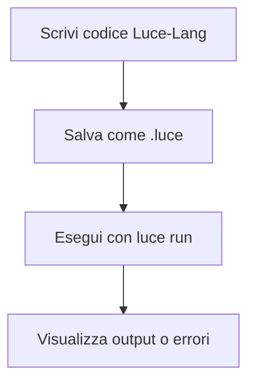

# 💡 Luce-Lang 💡
<div align="center">

  
</div>

## Introduzione

Luce-Lang è un linguaggio di programmazione moderno progettato per offrire sintassi chiara, prestazioni elevate e una piattaforma flessibile per lo sviluppo di applicazioni. Il progetto punta a combinare facilità d’uso, modularità e capacità di estensione, rendendo Luce-Lang adatto sia a sviluppatori principianti che a professionisti che necessitano di un linguaggio affidabile e scalabile.

## Installazione

L’installazione di Luce-Lang è semplice e supporta diversi ambienti. Segui questi passaggi per installare il linguaggio sul tuo sistema:
### LINUX
- Clona il repository ufficiale:
  ```bash
  git clone https://github.com/NickQuelloVero/Luce-Lang.git
  ```
- Accedi alla directory del progetto e compila con GCC:
  ```bash
  cd Luce-Lang
  g++ src/luce.cpp -o bin/luce
  ```
- Per eseguire il compilatore o l’interprete, utilizza il comando:
  ```bash
  luce
  ```
### WINDOWS
- Scarica l'ultima release e segui l'installer.
## Utilizzo

Luce-Lang offre una sintassi intuitiva e permette di scrivere, compilare ed eseguire script in modo rapido. Ecco alcune operazioni comuni:

- Per eseguire uno script scritto in Luce-Lang:
  ```bash
  luce run path/to/script.luce
  ```
- Per vedere l’output di esempio, crea un file `esempio.luce` con il seguente contenuto:
  ```luce
  scrivi "Ciao, Luce!"
  ```
  Poi eseguilo:
  ```bash
  luce run esempio.luce
  ```
- Il linguaggio supporta funzioni, strutture di controllo, e la gestione di variabili. Consulta la documentazione del linguaggio con luce docs per conoscere tutte le funzionalità implementate.

### Flusso di lavoro tipico



### Esempio di codice

```luce
scrivi "Scrivi la tua eta: "
leggi eta
se eta >= 18:
    scrivi "Puoi bere!!!"
altrimenti:
    scrivi "Non puoi bere!!!"  
```

## Licenza

Questo progetto è distribuito sotto licenza MIT. Puoi utilizzarlo, modificarlo e ridistribuirlo liberamente, sia per uso personale che commerciale. Consulta il file `LICENSE` per il testo completo della licenza.

---

Per ulteriori dettagli, contributi o segnalazioni di bug, visita la pagina ufficiale del repository su GitHub.
