# 💡 Luce-Lang

<div align="center">
  
  
  <br>

  [](https://opensource.org/licenses/MIT)
  [](https://github.com/NickQuelloVero/Luce-Lang/graphs/commit-activity)
  [](https://github.com/NickQuelloVero/Luce-Lang)

  <p align="center">
    <b>Un linguaggio di programmazione Open-Source veloce come C++, semplice come Python.</b>
  </p>
</div>

---

## 📖 Introduzione

**Luce-Lang** è un linguaggio di programmazione moderno progettato per offrire una **sintassi chiara**, prestazioni elevate e una piattaforma flessibile per imparare.

Il progetto punta a combinare facilità d’uso, modularità e capacità di estensione. Grazie alla sua sintassi intuitiva (spesso basata sull'italiano), Luce-Lang è adatto sia a **sviluppatori principianti** che vogliono imparare le basi della logica, sia a **professionisti** che necessitano di un linguaggio affidabile e scalabile.

---

## ⚙️ Installazione

L’installazione di Luce-Lang è semplice e supporta diversi ambienti. Segui questi passaggi per configurare il linguaggio sul tuo sistema.

###  Linux

1.  **Clona il repository ufficiale:**
    ```bash
    git clone https://github.com/NickQuelloVero/Luce-Lang.git
    ```

2.  **Compila il sorgente:**
    Accedi alla directory e compila utilizzando GCC (assicurati di avere `g++` installato).
    ```bash
    cd Luce-Lang
    mkdir -p bin
    g++ src/luce.cpp -o bin/luce
    ```

3.  **Esegui:**
    Per avviare il compilatore o l’interprete:
    ```bash
    ./bin/luce
    ```

###  Windows

1.  Scarica l'ultima release dalla sezione **Releases** di GitHub.
2.  Esegui l'installer `.exe` e segui le istruzioni a schermo.

---

## 🚀 Utilizzo

Luce-Lang offre una sintassi intuitiva e permette di scrivere, compilare ed eseguire script in modo rapido.

### Comandi Base

- **Eseguire uno script:**
  ```bash
  luce run path/to/script.luce
  ```

- **Hello World:**
  Crea un file chiamato `esempio.luce` con il seguente contenuto:
  ```javascript
  scrivi "Ciao, Luce!"
  ```
  Poi eseguilo:
  ```bash
  luce run esempio.luce
  ```

- **Documentazione:**
  Consulta la documentazione integrata per conoscere tutte le funzionalità:
  ```bash
  luce docs
  ```

### 🔄 Flusso di Lavoro 

```mermaid
flowchart LR
    A[📝 Scrivi codice .luce] --> B{Salva File}
    B --> C[⚙️ Esegui con 'luce run']
    C --> D[🖥️ Visualizza Output]
    C --> E[⚠️ Gestione Errori]
```



---

## 💻 Esempio di Codice

Ecco un esempio pratico che mostra l'input utente e le strutture di controllo in Luce-Lang:

```javascript
scrivi "Scrivi la tua età: "
leggi eta

se eta >= 18:
    scrivi "Puoi bere!"
altrimenti:
    scrivi "Non puoi bere!"  
```

---

## 📄 Licenza

Questo progetto è distribuito sotto licenza **MIT**.
Puoi utilizzarlo, modificarlo e ridistribuirlo liberamente, sia per uso personale che commerciale. Consulta il file `LICENSE` per il testo completo della licenza.

---

<div align="center">
  Creato da <b>Nicolò Morinelli</b>
</div>
